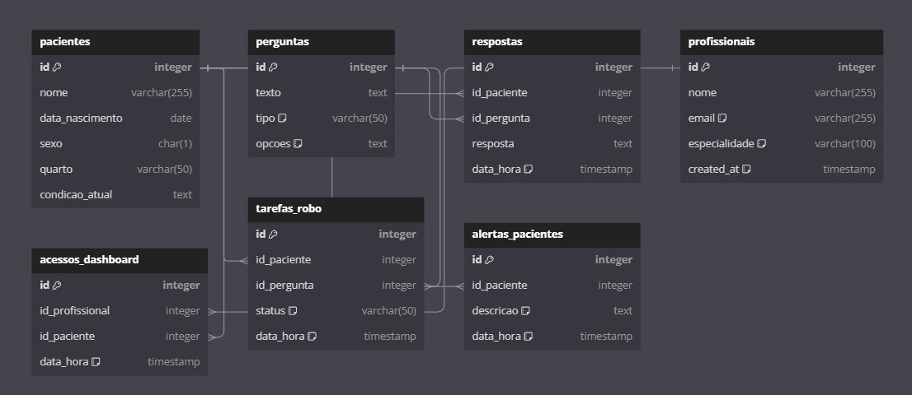

# 1. Estrutura de dados

Para estruturar os dados do projeto, utilizaremos um banco de dados NoSQL, como o MongoDB, o que oferece maior flexibilidade ao lidar com diferentes tipos de dados, sem a necessidade de esquemas rígidos. As coleções serão projetadas para armazenar os dados dos pacientes, as interações com o robô, as perguntas e respostas fornecidas, além de registrar os profissionais de saúde (médicos e enfermeiros) e suas interações com o sistema.

:::info
As coleções e estruturas apresentadas a seguir são apenas exemplos iniciais. Durante o desenvolvimento do projeto, ajustes poderão ser feitos conforme necessário.
:::

## 1.1 Coleções



:::warning
Embora este tipo de representação acima ser utilizada para bancos relacionais (o que não é o caso neste projeto), foi feito o diagrama acima apenas como forma de fazer uma demonstração mais tangível de como nossa estrutura de dados inicial está disposta
:::

### 1.1.1 Coleção `pacientes`

Esta coleção é utilizada para armazenar as informações pessoais e de saúde dos pacientes, além de registrar as respostas fornecidas por eles durante as interações com o robô e quaisquer alertas gerados com base em suas condições.

| Campo             | Descrição                               |
|-------------------|-----------------------------------------|
| `_id`             | Identificador único do paciente         |
| `nome`            | Nome completo do paciente               |
| `data_nascimento` | Data de nascimento                      |
| `sexo`            | Sexo (M/F/O)                            |
| `quarto`          | Número do quarto do paciente            |
| `condicao_atual`  | Descrição do estado de saúde atual      |


- Exemplo:

```json
{
  "_id": ObjectId("60c5fcadffgh123"),
  "nome": "João Silva",
  "data_nascimento": "1980-06-15",
  "sexo": "M",
  "quarto": "101",
  "condicao_atual": "Estável",
  "respostas": [
    {
      "id_pergunta": ObjectId("60c5fd02abc123"),
      "texto": "Como você está se sentindo?",
      "resposta": "Bem",
      "data_hora": "2024-06-23T10:00:00Z"
    }
  ],
  "alertas": [
    {
      "descricao": "Febre alta detectada",
      "data_hora": "2024-06-23T12:00:00Z"
    }
  ],
  "tarefas_turtlebot": [
    {
      "id_pergunta": ObjectId("60c5fd02abc123"),
      "status": "Completa",
      "data_hora": "2024-06-23T11:00:00Z"
    }
  ]
}
```

### 1.1.2 Coleção `perguntas` 

Esta coleção armazena as perguntas que podem ser feitas aos pacientes, incluindo o texto da pergunta e as opções de resposta disponíveis (quando aplicável). Cada pergunta está associada a um tipo, como "sentimento" ou "dor", para facilitar a categorização.

| Campo  | Descrição                                     |
|--------|-----------------------------------------------|
| `_id`  | Identificador único da pergunta               |
| `texto`| Texto da pergunta                             |
| `tipo` | Tipo da pergunta (ex.: "sentimento", "dor")   |
| `opcoes`| Possíveis opções de resposta (se aplicável)  |

- Exemplo:

```json
{
  "_id": ObjectId("60c5fd02abc123"),
  "texto": "Como você está se sentindo?",
  "tipo": "sentimento",
  "opcoes": ["Bem", "Mal", "Regular"]
}
```


### 1.1.3 Coleção `respostas`

Esta coleção armazena as respostas fornecidas pelos pacientes para as perguntas feitas pelo robô, associando cada resposta ao paciente e à pergunta correspondente.

| Campo           | Descrição                                          |
|-----------------|----------------------------------------------------|
| `_id`           | Identificador único da resposta                    |
| `id_paciente`   | Referência ao paciente (Foreign Key)               |
| `id_pergunta`   | Referência à pergunta respondida (Foreign Key)     |
| `resposta`      | Resposta fornecida pelo paciente                   |
| `data_hora`     | Data e hora da resposta                            |

- Exemplo:

```json
{
  "_id": ObjectId("60c5ffghijkl789"),
  "id_paciente": ObjectId("60c5fcadffgh123"),
  "id_pergunta": ObjectId("60c5fd02abc123"),
  "resposta": "Bem",
  "data_hora": "2024-06-23T10:00:00Z"
}

```

### 1.1.4 Coleção `profissionais`

Esta coleção é usada para armazenar os dados dos profissionais de saúde que interagem com o sistema, como médicos e enfermeiros. Inclui informações de login e especialidade, além de manter um histórico de acessos ao dashboard de pacientes.

| Campo            | Descrição                                        |
|------------------|--------------------------------------------------|
| `_id`            | Identificador único do profissional              |
| `nome`           | Nome completo do profissional                    |
| `email`          | Email para login e contato                       |
| `funcao`         | Função do profissional (médico/enfermeiro)        |
| `especialidade`  | Especialidade do profissional (se aplicável)      |
| `created_at`     | Data de criação do cadastro                      |

- Exemplo:

```json
{
  "_id": ObjectId("60c5fd8e123456"),
  "nome": "Dr. Ana Pereira",
  "email": "ana.pereira@hospital.com",
  "especialidade": "Enfermagem",
  "created_at": "2024-06-22T10:00:00Z",
  "acessos_dashboard": [
    {
      "paciente_id": ObjectId("60c5fcadffgh123"),
      "data_hora": "2024-06-23T10:30:00Z"
    }
  ]
}
```

### 1.1.5 Coleção `acessos_dashboard`

Esta coleção registra os acessos que os profissionais de saúde fazem ao dashboard de pacientes, vinculando o profissional e o paciente cujos dados foram acessados, com registro da data e hora.

| Campo            | Descrição                                         |
|------------------|---------------------------------------------------|
| `_id`            | Identificador único do acesso                     |
| `id_profissional`| Referência ao profissional que acessou o dashboard|
| `id_paciente`    | Referência ao paciente cujos dados foram acessados|
| `data_hora`      | Data e hora do acesso                             |

- Exemplo:

```json
{
  "_id": ObjectId("60c5fe123abc678"),
  "id_profissional": ObjectId("60c5fd8e123456"),
  "paciente_id": ObjectId("60c5fcadffgh123"),
  "data_hora": "2024-06-23T10:30:00Z"
}
```


### 1.1.6 Coleção `tarefas_robo`

Esta coleção registra as tarefas programadas para o robô, como as perguntas que ele deve fazer aos pacientes. Ela também acompanha o status da tarefa (pendente ou completa) e a data e hora em que foi ou será executada.

| Campo           | Descrição                                     |
|-----------------|-----------------------------------------------|
| `_id`           | Identificador único da tarefa                 |
| `id_paciente`   | Referência ao paciente visitado               |
| `id_pergunta`   | Referência à pergunta feita                   |
| `status`        | Status da tarefa (ex.: "pendente", "completa")|
| `data_hora`     | Data e hora programada para a execução        |

- Exemplo:

```json
{
  "_id": ObjectId("60c5ffghijkl789"),
  "paciente_id": ObjectId("60c5fcadffgh123"),
  "id_pergunta": ObjectId("60c5fd02abc123"),
  "status": "Pendente",
  "data_hora": "2024-06-23T11:00:00Z"
}
```

### 1.1.7 Coleção `alertas_pacientes`

Esta coleção armazena os alertas gerados com base em eventos críticos relacionados ao estado de saúde dos pacientes, como febre alta ou queda brusca na condição.

| Campo           | Descrição                                          |
|-----------------|----------------------------------------------------|
| `_id`           | Identificador único do alerta                      |
| `id_paciente`   | Referência ao paciente relacionado ao alerta       |
| `descricao`     | Descrição do alerta                                |
| `data_hora`     | Data e hora do alerta gerado                       |

- Exemplos:

```json
{
  "_id": ObjectId("60c600abcdef012"),
  "paciente_id": ObjectId("60c5fcadffgh123"),
  "descricao": "Febre alta detectada",
  "data_hora": "2024-06-23T12:00:00Z"
}
```

### 1.1.8 Coleção `login`

Está coleção tem o intuito apenas de armazenar o login do sistema.

| Campo           | Descrição                                          |
|-----------------|----------------------------------------------------|
| `_id`           | Identificador único de login                       |
| `email`         | Email do profissional para login                   |
| `senha`         | Senha criptografada para autenticação              |
| `data_ultimo_acesso` | Data e hora do último acesso ao sistema        |

- Exemplo

```json
{
  "_id": ObjectId("60c601234567890"),
  "email": "joao.silva@hospital.com",
  "senha": "senhaSegura123",
  "id_profissional": ObjectId("60c5fd8e123456"),
  "created_at": "2024-06-22T10:00:00Z"
}
```

---

## Conclusão

Com o uso de MongoDB, o projeto ganha flexibilidade para adaptar o armazenamento de dados às necessidades em constante evolução, lidando de forma eficiente com informações sobre pacientes, interações do robô, profissionais de saúde e tarefas automatizadas. Essa estrutura baseada em coleções permite que as operações sejam realizadas de maneira simples, sem a necessidade de esquemas complexos, garantindo escalabilidade à medida que o volume de dados cresce.
