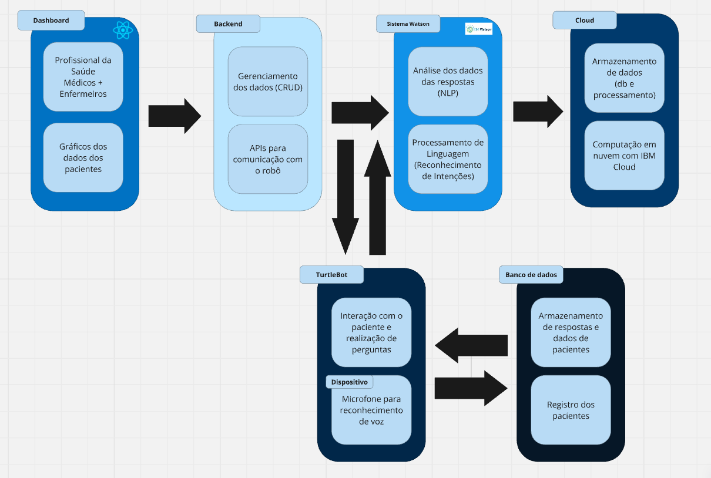

# 1. Proposta da Solução Inicial

A proposta apresentada visa a implementação de uma solução inovadora para o monitoramento da saúde dos pacientes, utilizando um robô TurtleBot. Este robô será encarregado de interagir diretamente com os pacientes em seus quartos, realizando perguntas de checagem frequentemente feitas por médicos e enfermeiros. Perguntas como "Como você está se sentindo?", "Está com alguma dor em alguma região?" e "Se está com dor na região X, classifique sua dor de 0 a 10" serão formuladas pelo robô, permitindo uma coleta de dados rápida e eficiente.

As respostas obtidas pelo TurtleBot serão enviadas para um sistema centralizado, onde serão armazenadas e processadas. Esses dados serão apresentados em um dashboard acessível por médicos e enfermeiros, proporcionando uma visualização clara e concisa do estado de saúde dos pacientes. Com essa abordagem, os profissionais de saúde poderão se preparar melhor para suas visitas, abordando de forma mais direcionada as necessidades e preocupações dos pacientes, resultando em um atendimento mais eficiente e personalizado.

## 1.1 Diagrama de Blocos Detalhado

O diagrama de blocos abaixo ilustra a arquitetura da solução proposta, mostrando as interações entre os componentes do sistema:

### 1.1.1 Descrição dos Componentes no Diagrama de Blocos

#### 1.1.1.1 Front-end
O front-end representa a interface do usuário através da qual os profissionais de saúde interagem com o sistema. Por meio de um dashboard intuitivo e responsivo, médicos e enfermeiros têm acesso às informações coletadas pelo TurtleBot, além de dados históricos sobre a saúde dos pacientes. Essa interface é crucial para facilitar a análise e interpretação dos dados em tempo real.

#### 1.1.1.2 Backend
O backend é responsável por gerenciar todas as operações de processamento de dados. Ele lida com a lógica de negócios, valida as informações recebidas do TurtleBot e prepara os dados para serem armazenados no banco de dados. Além disso, o backend fornece as APIs necessárias para permitir a comunicação fluida entre o front-end, o TurtleBot e o Watson, garantindo que todas as partes do sistema funcionem de forma integrada.

#### 1.1.1.3 Watson
O Watson, tecnologia da IBM, utiliza inteligência artificial e técnicas de processamento de linguagem natural para analisar as respostas dos pacientes. Ele transforma dados brutos em insights, permitindo que os profissionais de saúde identifiquem padrões e tomem decisões informadas com base nas respostas coletadas. O Watson se conecta ao backend para receber os dados em tempo real e fornecer análises dinâmicas.

#### 1.1.1.4 Cloud
A nuvem fornece a infraestrutura necessária para armazenar e processar grandes volumes de dados de maneira segura e escalável. Os dados coletados pelo TurtleBot são enviados para a nuvem, onde são armazenados e podem ser acessados a qualquer momento. A computação em nuvem permite que o sistema se adapte rapidamente à demanda, garantindo que os dados estejam sempre disponíveis e acessíveis para análises.

#### 1.1.1.5 TurtleBot3
O TurtleBot3 é um robô móvel projetado para interagir diretamente com os pacientes. Equipado com sensores e tecnologia de navegação, ele se desloca pelos quartos, faz as perguntas pertinentes e coleta as respostas. A comunicação entre o TurtleBot e o backend é essencial, pois permite que os dados sejam transmitidos e analisados em tempo real, contribuindo para a automação do processo de checagem de saúde e melhorando a eficiência no atendimento.

#### 1.1.1.6 Banco de Dados
O banco de dados é o repositório central onde todas as informações coletadas, incluindo as respostas dos pacientes e os dados analisados pelo Watson, são armazenadas. Ele garante que todos os componentes do sistema, incluindo o front-end e o backend, tenham acesso a informações atualizadas e precisas. A estrutura do banco de dados deve ser otimizada para permitir consultas rápidas e eficientes, facilitando a análise dos dados.

---

## Conclusão

O diagrama de blocos apresentado é uma proposta inicial para este projeto, detalhando as tecnologias e interações que formarão a base da solução. Esta proposta é de extrema importância, pois permitirá moldar os próximos passos do projeto e tomar decisões mais assertivas. A integração eficaz de cada componente, desde o TurtleBot até a nuvem, assegurará um atendimento mais proativo e centrado no paciente, transformando a maneira como os cuidados de saúde são administrados.
